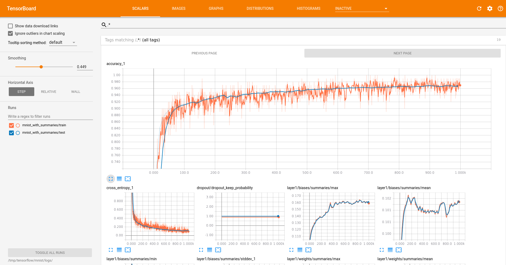

# TensorBoard Handleiding

TensorBoard is een visuele tool van TensorFlow om training, metrics en modellen te monitoren. Je kan het gebruiken om grafieken, loss, accuracy, en modelstructuren te bekijken.

---

## Installatie

TensorBoard kan geïnstalleerd worden via pip:

```bash
pip install tensorboard
```
Controleer de installatie:

```bash
tensorboard --version
```
---

### Basisconcepten

| Term          | Uitleg                                                                             |
| ------------- | ---------------------------------------------------------------------------------- |
| **Logdir**    | Directory waar TensorBoard de logs van training en metrics opslaat.                |
| **Summary**   | TensorFlow objecten die waardes zoals scalars, images, histograms en more tracken. |
| **Scalar**    | Numerieke waarde die verandert over training (bijv. loss, accuracy).               |
| **Histogram** | Verdeling van een tensor over tijd (bijv. gewichten van een laag).                 |
| **Graph**     | Visualisatie van het computationele model.                                         |

---

### Logging in TensorFlow
Voorbeeld van logging met scalars:

```python
import tensorflow as tf

# Log directory
log_dir = "logs/fit"
summary_writer = tf.summary.create_file_writer(log_dir)

# Training loop voorbeeld
for step in range(100):
    loss = 0.1 * step  # voorbeeld
    with summary_writer.as_default():
        tf.summary.scalar('loss', loss, step=step)
```
---

###  TensorBoard starten
Start TensorBoard in de terminal:

```bash
tensorboard --logdir=logs/fit
```
Optioneel met een specifieke poort:

```bash
tensorboard --logdir=logs/fit --port=6006
```
Open daarna in browser:

```bash
http://localhost:6006
```
---

###  Belangrijke commando’s
| Commando                                  | Functie                                                     |
| ----------------------------------------- | ----------------------------------------------------------- |
| `tensorboard --logdir=<path>`             | Start TensorBoard met de gegeven log directory              |
| `tensorboard --inspect --logdir=<path>`   | Inspecteert de logs en geeft informatie over events en tags |
| `tensorboard --reload_interval=<seconds>` | Interval in seconden om logs opnieuw in te lezen            |
| `tensorboard dev upload --logdir=<path>`  | Upload logs naar TensorBoard.dev voor delen                 |

---

###  TensorBoard Plugins
| Plugin        | Beschrijving                                               |
| ------------- | ----------------------------------------------------------|
| Scalars       | Visualiseert numerieke waardes over tijd (loss, accuracy) |
| Graphs        | Visualiseert computationele grafen van TensorFlow modellen |
| Histograms    | Visualiseert distributies van tensorwaarden                |
| Distributions | Vergelijkbaar met histograms, continu zichtbaar over tijd  |
| Images        | Visualiseert beelden (bijv. inputs, outputs)               |
| Audio         | Audio samples tijdens training                              |
| Text          | Tekst outputs of predictions                                |
| Projector     | Voor visualisatie van embeddings in 2D/3D                  |

### TensorBoard in Jupyter Notebook
Je kan TensorBoard in een notebook starten:

```python
%load_ext tensorboard
%tensorboard --logdir logs/fit
```
---

### TensorBoard.dev
TensorBoard.dev is een gratis online platform om logs te delen:

```bash
tensorboard dev upload --logdir logs/fit
```
Dit uploadt je logs naar TensorBoard.dev. Je krijgt een URL om je experimenten te bekijken en te delen.

---

### Tips en Best Practices
Zorg dat log_dir uniek is per experiment, bv. met timestamp:

```python
log_dir = "logs/fit/" + datetime.now().strftime("%Y%m%d-%H%M%S")
```
Gebruik duidelijke tags voor scalars, bv. `train_loss`, `val_loss`.

Minimaliseer logging van grote tensors (bijv. full images) als je veel epochs hebt.

Sluit TensorBoard als je meerdere keren runt, anders poortconflict.

---

### Samengevatte workflow

Creëer log directory

Schrijf TensorFlow summaries

Start TensorBoard

Bekijk resultaten in browser

Deel eventueel via TensorBoard.dev

---
### nuttige bronnen
- [TensorBoard officiële documentatie](https://www.tensorflow.org/tensorboard)
- [TensorBoard tutorial](https://www.tensorflow.org/tensorboard/get_started)
