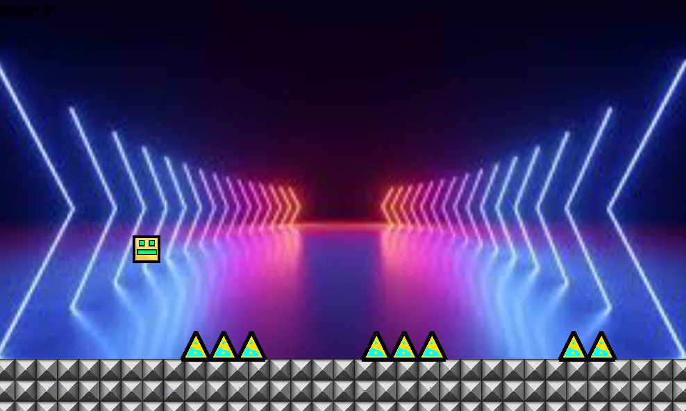

# AI Geometry Dash

  
*AI speelt een Geometry Dash-achtig spel met behulp van reinforcement learning (PPO).*

---

## Overzicht

Dit project bevat een AI-agent die leert spelen in een Geometry Dash-achtige omgeving. Het gebruikt **Python**, **Pygame** voor de visuele game, en **Stable-Baselines3** voor reinforcement learning.  

Belangrijke functies:

- Volledige Pygame-implementatie van het spel.
- Gym-compatibele omgeving (`geometry_dash_env.py`) voor training.
- Training via PPO met resume-functionaliteit.
- Visuele runner om getrainde modellen te observeren.
- TensorBoard integratie voor realtime monitoring van training.

---

## Repository structuur

```text
.gitignore
.venv/
ai_omgeving/
AI_Programming_projectvoorstellen.docx
documentation/
readme.md
__pycache__/
```

## Belangerijkste mappen en bestanden in  ai_omgeving/

```text
ai_omgeving/
├─ audio.py                  # Audiobeheer voor het spel
├─ geometry_dash_game.py     # Pygame-implementatie
├─ geometry_dash_env.py      # Gym-compatibele omgeving
├─ train_geometry_dash.py    # Trainingsscript met PPO
├─ run_model_in_game.py      # Visualisatie van een getraind model
├─ run_best_model.py         # Shortcut om het beste model te laden
├─ test_geometry_dash.py     # Testscript voor de runner
├─ launch_tensorboard.py     # Start TensorBoard
├─ requirements.txt          # Python dependencies
├─ images/                   # Achtergronden, blokken, sprites
├─ sounds/                   # Geluidseffecten en muziek
├─ models/                   # Checkpoints en getrainde modellen
├─ best_model/               # Best-performing model
```

Quickstart (Windows PowerShell)

1. Virtuele omgeving maken en activeren:

```powershell
python -m venv .venv
& .\.venv\Scripts\Activate.ps1
pip install -r ai_omgeving\requirements.txt
```

2. Training starten (basis):

```powershell
& .\.venv\Scripts\python.exe ai_omgeving\train_geometry_dash.py
```

3. Visualiseer een getraind model:

```powershell
& .\.venv\Scripts\python.exe ai_omgeving\run_model_in_game.py --model ai_omgeving\best_model\gd_ppo_final_model.zip
```

4. TensorBoard starten (voor monitoring van training):

```powershell
& .\.venv\Scripts\python.exe ai_omgeving\launch_tensorboard.py
```

## Belangrijke scripts

|bestand|Bestand Beschrijving|
|-------------------|--------------------|
|geometry_dash_game.py|Pygame-game met API (reset(), update(), ai_jump(), get_state_vector()).|
|geometry_dash_env.py|Gym-wrapper voor RL-training met dezelfde physics als de visuele game.|
|train_geometry_dash.py|Train een AI-agent (PPO). Ondersteunt --resume en --resume-model.|
|run_model_in_game.py|Laad een model en speel het spel visueel. Gebruikt assets uit images/ en sounds/.|
|run_best_model.py|Shortcut om het beste model te laden.|
|test_geometry_dash.py|Testscript voor de runner met standaardassets.|
|launch_tensorboard.py|Start TensorBoard voor realtime trainingslogs.|

## Assets

- Images: ai_omgeving/images/

- Sounds: ai_omgeving/sounds/

Je kunt hier aangepaste achtergronden, blokken of muziek plaatsen.

## Tips & Tricks

- Resume training met specifieke checkpoints:

```powershell
& .\.venv\Scripts\python.exe ai_omgeving\train_geometry_dash.py --resume --resume-model ai_omgeving\models\checkpoint_50000.zip
```

- Schakel audio uit tijdens training:

```powershell
& .\.venv\Scripts\python.exe ai_omgeving\train_geometry_dash.py --no-audio
```

- Limiteer het aantal stappen per training run:

```powershell
& .\.venv\Scripts\python.exe ai_omgeving\train_geometry_dash.py --max-steps 100000
```

- TensorBoard logs bevinden zich standaard in: ai_omgeving/gd_tensorboard/
