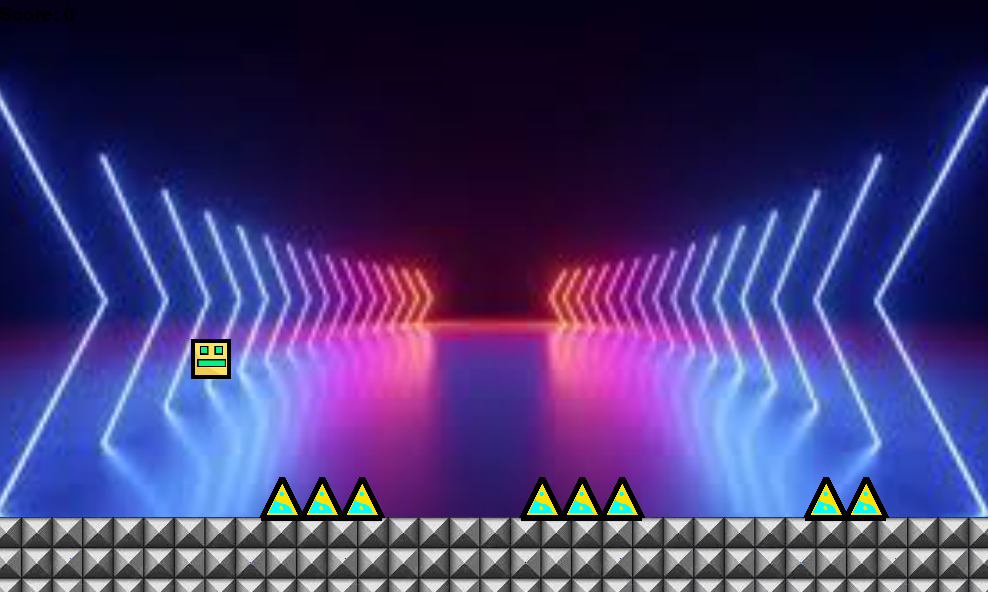

# AI Geometry Dash

  
*AI speelt een Geometry Dash-achtig spel met behulp van reinforcement learning (PPO).*

---
## leden van het project:
| naam | github |
|-------|--------|
|Arthur Brasseart|[](https://github.com/Arthur-Brassaert)
|Juha Schacht|[](https://github.com/Jschacht06)
|Kyell De Windt|[](https://github.com/kyell182)

## Docent:
| naam | github |
|-------|--------|
|Franky Loret |[](https://github.com/FrankyLoret)
 

## Overzicht

Dit project bevat een AI-agent die leert spelen in een Geometry Dash-achtige omgeving. Het gebruikt **Python**, **Pygame** voor de visuele game, en **Stable-Baselines3** voor reinforcement learning.  

Belangrijke functies:

- Volledige Pygame-implementatie van het spel.
- Gym-compatibele omgeving (`geometry_dash_env.py`) voor training.
- Training via PPO met resume-functionaliteit.
- Visuele runner om getrainde modellen te observeren.
- TensorBoard integratie voor realtime monitoring van training.

---

## Repository structuur

```text
.gitignore
.venv/
ai_omgeving/
AI_Programming_projectvoorstellen.docx
documentation/
readme.md
__pycache__/
```

## Belangrijkste mappen en bestanden in ai_omgeving/

```text
ai_omgeving/
├─ audio.py                  # Audiobeheer voor het spel
├─ config.py                 # Centraliseerde configuratie (OBS_HORIZON, GRAVITY, etc.)
├─ geometry_dash_game.py     # Pygame-implementatie
├─ geometry_dash_env.py      # Gym-compatibele omgeving voor training
├─ train_geometry_dash.py    # Trainingsscript (PPO met resume-ondersteuning)
├─ run_model_in_game.py      # Model visueel afspelen in het spel
├─ run_best_model.py         # Laad het beste model automatisch
├─ launch_tensorboard.py     # Start TensorBoard voor trainingslogs
├─ requirements.txt          # Python dependencies
├─ images/                   # Achtergronden, blokken, obstacles, floors
├─ sounds/                   # Geluidseffecten en muziek
├─ best_model/               # Opgeslagen best-performing model + vec_normalize
├─ gd_tensorboard/           # TensorBoard logs per trainingsrun
└─ data/                     # Trainingsdata
```

## Quickstart

1. Virtuele omgeving activeren en dependencies installeren:

```bash
source .venv/bin/activate
pip install -r ai_omgeving/requirements.txt
```

2. Training starten:

```bash
python ai_omgeving/train_geometry_dash.py
```

   Of hervatten vanaf een bestaand model:

```bash
python ai_omgeving/train_geometry_dash.py --resume
```

3. Visualiseer het beste model:

```bash
python ai_omgeving/run_best_model.py --max-steps 1000
```

   Of een specifiek model:

```bash
python ai_omgeving/run_model_in_game.py --model ai_omgeving/best_model/model.zip
```

4. TensorBoard starten (optioneel):

```bash
python ai_omgeving/launch_tensorboard.py
```

## Belangrijke scripts

|Bestand|Beschrijving|
|--------|------------|
|geometry_dash_game.py|Pygame-game implementatie met API (reset(), update(), ai_jump(), get_state_vector()).
|geometry_dash_env.py|Gym-omgeving voor RL-training met dezelfde physics als de visuele game.
|config.py|Centraliseerde configuratie (afmetingen, physics, moeilijkheid, observatie-instellingen).
|train_geometry_dash.py|Training script (PPO). Ondersteunt `--resume` en `--resume-model`.
|run_model_in_game.py|Model visueel afspelen. Laadt automatisch vec_normalize.pkl indien aanwezig.
|run_best_model.py|Laadt het beste model uit `best_model/` automatisch.
|launch_tensorboard.py|Start TensorBoard dashboard voor trainingslogs.
|audio.py|Geluidseffecten en muziek beheer.
|visuals.py|Visuele hulpfuncties (als aanwezig).|

## Assets

- **Images**: `ai_omgeving/images/` (backgrounds, blocks, floors, obstacles)
- **Sounds**: `ai_omgeving/sounds/` (level songs, sound effects)

Deze worden automatisch geladen tijdens playback. Je kunt hier aangepaste achtergronden, blokken of muziek plaatsen.

## Tips & Tricks

- **Resume training** van het nieuwste model:
  ```bash
  python ai_omgeving/train_geometry_dash.py --resume
  ```

- **Resume van specifiek model**:
  ```bash
  python ai_omgeving/train_geometry_dash.py --resume-model path/to/model.zip
  ```

- **VecNormalize automatisch inladen** (tijdens playback):
  Het script zoekt automatisch naar `vec_normalize.pkl` in `best_model/`.

- **TensorBoard logs**:
  Logs bevinden zich in `ai_omgeving/gd_tensorboard/`. Start TensorBoard met:
  ```bash
  python ai_omgeving/launch_tensorboard.py
  ```

Voor meer details, zie:

[AI Geometry Dash Handleiding](/documentation/AI-GEOMETRY-DASH-README.md).

en

[AI training details](/documentation/geometry-dash-training-details.md).